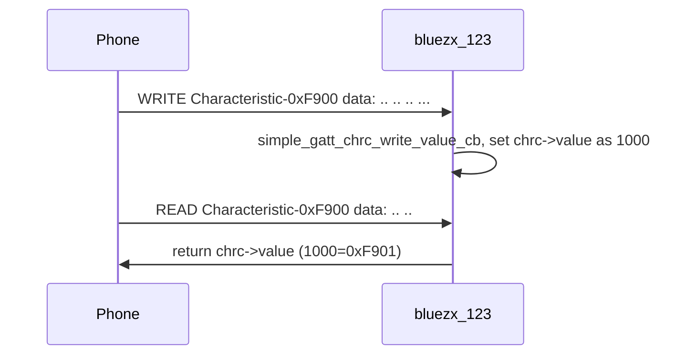
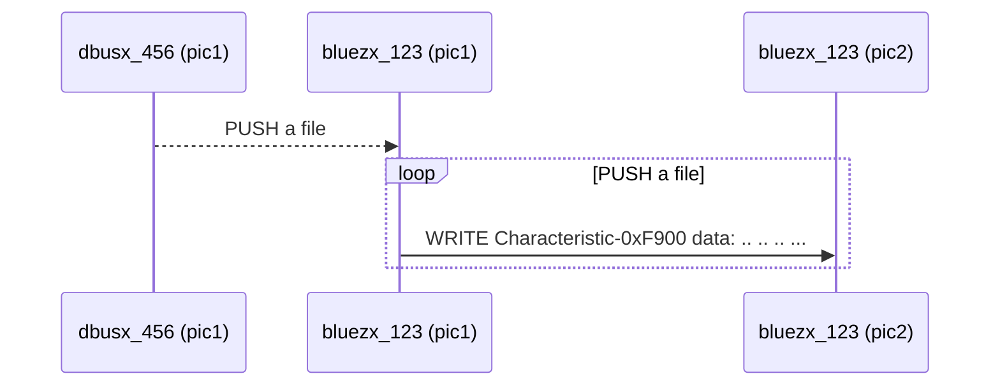

# 1. Overview
BlueZX is based on [BlueZ](http://www.bluez.org/) (bluez-5.56).

It wrapped all features of bluetoothctl and provides some callback functions.

You can create a noninteractive daemon easily.

# 2. Depend on

- [utilx9](https://github.com/lankahsu520/utilx9)
- [BlueZ](http://www.bluez.org)

# 3. Current Status


# 4. Build
   ```
$ make
   ```

# 5. Example or Usage
- bluetoothctl_clone - it is the same as bluetoothctl.

- bluezx_123 - a daemon.

```bash
$ ./bluezx_123 -d3
```

```c
#define UUID16_LANKAHSU520_SERVICE_F999           0xF999
#define UUID16_LANKAHSU520_CHRC_F900              0xF900
#define UUID16_LANKAHSU520_CHRC_F901              0xF901

```

# 6. License
BlueZX is based on [BlueZ](http://www.bluez.org/).


# 7. Documentation
Run an example and read it.

## 7.1. TestCase A



## 7.2. TestCase B


```bash
export BLUEZX_COMMAND="scan&on"
export BLUEZX_COMMAND="scan&off"
export BLUEZX_COMMAND="advertise.name&on"
export BLUEZX_COMMAND="advertise.timeout&120"
export BLUEZX_COMMAND="advertise&on"

export BLUEZX_COMMAND="pair&90:E8:68:85:9A:0A"
export BLUEZX_COMMAND="connect&90:E8:68:85:9A:0A"
export BLUEZX_COMMAND="disconnect&90:E8:68:85:9A:0A"

export BLUEZX_COMMAND="gatt.list-attributes&90:E8:68:85:9A:0A"
export BLUEZX_COMMAND="gatt.select-attribute&0000F999-0000-1000-8000-00805f9b34fb"
export BLUEZX_COMMAND="gatt.select-attribute&0000F900-0000-1000-8000-00805f9b34fb"
export BLUEZX_COMMAND="gatt.select-attribute&0000F901-0000-1000-8000-00805f9b34fb"

export BLUEZX_COMMAND="gatt.write&0xFF 0xFE 0x7B 0x22 0x75 0x73 0x65 0x72 0x22 0x3A 0x22 0x6C 0x61 0x6E 0x6B 0x61 0x22 0x7D 0xFF 0xFF"
export BLUEZX_COMMAND="gatt.write&0xFF 0xFE 0xFF 0xFF"
export BLUEZX_COMMAND="gatt.write&0x1C 0x56"
export BLUEZX_COMMAND="gatt.push&/work/codebase/testing.json"
export BLUEZX_COMMAND="gatt.stop"

export BLUEZX_COMMAND="debug"

./dbusx_456 -e "$BLUEZX_COMMAND"
```

## 7.3. TestCase C



```bash
export BLUEZX_COMMAND="gatt.select-attribute&0000F900-0000-1000-8000-00805f9b34fb"
export BLUEZX_COMMAND="gatt.push&/work/codebase/testing.json"
export BLUEZX_COMMAND="gatt.stop"
export BLUEZX_COMMAND="debug"

./dbusx_456 -e "$BLUEZX_COMMAND"
```

# Appendix

# I. BlueZX

## I.1. bluetoothctl_clone

### II.1.1. Usage

```bash
Commands:
        repeater        Repeater
        debug           Set Debug Level 0~4
        list            List available controllers
        show            Controller information
        select          Select default controller
        devices         List available devices
        paired-devices  List paired devices
        system-alias    Set controller alias
        reset-alias     Reset controller alias
        power           Set controller power
        pairable        Set controller pairable mode
        discoverable    Set controller discoverable mode
        discoverable-timeout    Set discoverable timeout
        agent           Enable/disable agent with given capability
        default-agent   Set agent as the default one
        advertise       Enable/disable advertising with given type
        set-alias       Set device alias
        scan            Scan for devices
        info            Device information
        pair            Pair with device
        cancel-pairing  Cancel pairing with device
        trust           Trust device
        untrust         Untrust device
        block           Block device
        unblock         Unblock device
        remove          Remove device
        connect         Connect device
        disconnect      Disconnect device

        advertise.:
                uuids           Set/Get advertise uuids
                service         Set/Get advertise service data
                manufacturer    Set/Get advertise manufacturer data
                data            Set/Get advertise data
                discoverable    Set/Get advertise discoverable
                discoverable-timeout    Set/Get advertise discoverable timeout
                tx-power        Show/Enable/Disable TX power to be advertised
                name            Configure local name to be advertised
                appearance      Configure custom appearance to be advertised
                duration        Set/Get advertise duration
                timeout         Set/Get advertise timeout
                secondary       Set/Get advertise secondary channel
                clear           Clear advertise config

        monitor.:
                set-rssi-threshold      Set RSSI threshold parameter
                set-rssi-timeout        Set RSSI timeout parameter
                set-rssi-sampling-period        Set RSSI sampling period parameter
                add-or-pattern  Register 'or pattern' type monitor with the specified RSSI parameters
                get-pattern     Get advertisement monitor
                remove-pattern  Remove advertisement monitor
                get-supported-info      Get advertisement manager supported features and supported monitor types
                print-usage     Print the command usage

        scan.:
                uuids           Set/Get UUIDs filter
                rssi            Set/Get RSSI filter, and clears pathloss
                pathloss        Set/Get Pathloss filter, and clears RSSI
                transport       Set/Get transport filter
                duplicate-data  Set/Get duplicate data filter
                discoverable    Set/Get discoverable filter
                pattern         Set/Get pattern filter
                clear           Clears discovery filter.

        gatt.:
                read_chrc       Read characteristic value
                list-attributes List attributes
                select-attribute        Select attribute
                attribute-info  Select attribute
                read            Read attribute value
                write           Write attribute value
                push            Push a file
                stop            Stop pushing
                acquire-write   Acquire Write file descriptor
                release-write   Release Write file descriptor
                acquire-notify  Acquire Notify file descriptor
                release-notify  Release Notify file descriptor
                notify          Notify attribute value
                clone           Clone a device or attribute
                register-application    Register profile to connect
                unregister-application  Unregister profile
                register-service        Register application service.
                unregister-service      Unregister application service
                register-includes       Register as Included service in.
                unregister-includes     Unregister Included service.
                register-characteristic Register application characteristic
                unregister-characteristic       Unregister application characteristic
                register-descriptor     Register application descriptor
                unregister-descriptor   Unregister application descriptor

```

# II. [BlueZ](http://www.bluez.org/)

## II.1. [Main BlueZ tree - GitHub](https://www.google.com/url?sa=t&rct=j&q=&esrc=s&source=web&cd=&ved=2ahUKEwihnYTJ7734AhXXAaYKHXNJAEUQFnoECAUQAQ&url=https%3A%2F%2Fgithub.com%2Fbluez%2Fbluez&usg=AOvVaw0MThZWOGRFpL3nnm3V_1Hc)
## II.2. bluetoothctl

### II.2.1. Usage

```bash
$ bluetoothctl --help
bluetoothctl ver 5.53
Usage:
        bluetoothctl [--options] [commands]
Options:
        --agent         Register agent handler: <capability>
        --monitor       Enable monitor output
        --timeout       Timeout in seconds for non-interactive mode
        --version       Display version
        --help          Display help
Commands:
        list            List available controllers
        show            Controller information
        select          Select default controller
        devices         List available devices
        paired-devices  List paired devices
        system-alias    Set controller alias
        reset-alias     Reset controller alias
        power           Set controller power
        pairable        Set controller pairable mode
        discoverable    Set controller discoverable mode
        discoverable-timeout    Set discoverable timeout
        agent           Enable/disable agent with given capability
        default-agent   Set agent as the default one
        advertise       Enable/disable advertising with given type
        set-alias       Set device alias
        scan            Scan for devices
        info            Device information
        pair            Pair with device
        trust           Trust device
        untrust         Untrust device
        block           Block device
        unblock         Unblock device
        remove          Remove device
        connect         Connect device
        disconnect      Disconnect device

        advertise.:
                uuids           Set/Get advertise uuids
                service         Set/Get advertise service data
                manufacturer    Set/Get advertise manufacturer data
                data            Set/Get advertise data
                discoverable    Set/Get advertise discoverable
                discoverable-timeout    Set/Get advertise discoverable timeout
                tx-power        Show/Enable/Disable TX power to be advertised
                name            Configure local name to be advertised
                appearance      Configure custom appearance to be advertised
                duration        Set/Get advertise duration
                timeout         Set/Get advertise timeout
                secondary       Set/Get advertise secondary channel
                clear           Clear advertise config

        scan.:
                uuids           Set/Get UUIDs filter
                rssi            Set/Get RSSI filter, and clears pathloss
                pathloss        Set/Get Pathloss filter, and clears RSSI
                transport       Set/Get transport filter
                duplicate-data  Set/Get duplicate data filter
                discoverable    Set/Get discoverable filter
                clear           Clears discovery filter.

        gatt.:
                list-attributes List attributes
                select-attribute        Select attribute
                attribute-info  Select attribute
                read            Read attribute value
                write           Write attribute value
                acquire-write   Acquire Write file descriptor
                release-write   Release Write file descriptor
                acquire-notify  Acquire Notify file descriptor
                release-notify  Release Notify file descriptor
                notify          Notify attribute value
                clone           Clone a device or attribute
                register-application    Register profile to connect
                unregister-application  Unregister profile
                register-service        Register application service.
                unregister-service      Unregister application service
                register-includes       Register as Included service in.
                unregister-includes     Unregister Included service.
                register-characteristic Register application characteristic
                unregister-characteristic       Unregister application characteristic
                register-descriptor     Register application descriptor
                unregister-descriptor   Unregister application descriptor

```

### I.2.2. Menu gatt

```bash
Menu gatt:
Available commands:
-------------------
list-attributes [dev/local]                       List attributes
select-attribute <attribute/UUID>                 Select attribute
attribute-info [attribute/UUID]                   Select attribute
read [offset]                                     Read attribute value
write <data=xx xx ...> [offset] [type]            Write attribute value
acquire-write                                     Acquire Write file descriptor
release-write                                     Release Write file descriptor
acquire-notify                                    Acquire Notify file descriptor
release-notify                                    Release Notify file descriptor
notify <on/off>                                   Notify attribute value
clone [dev/attribute/UUID]                        Clone a device or attribute
register-application [UUID ...]                   Register profile to connect
unregister-application                            Unregister profile
register-service <UUID> [handle]                  Register application service.
unregister-service <UUID/object>                  Unregister application service
register-includes <UUID> [handle]                 Register as Included service in.
unregister-includes <Service-UUID><Inc-UUID>      Unregister Included service.
register-characteristic <UUID> <Flags=read,write,notify...> [handle] Register application characteristic
unregister-characteristic <UUID/object>           Unregister application characteristic
register-descriptor <UUID> <Flags=read,write...> [handle] Register application descriptor
unregister-descriptor <UUID/object>               Unregister application descriptor
back                                              Return to main menu
version                                           Display version
quit                                              Quit program
exit                                              Quit program
help                                              Display help about this program
export                                            Print environment variables

```