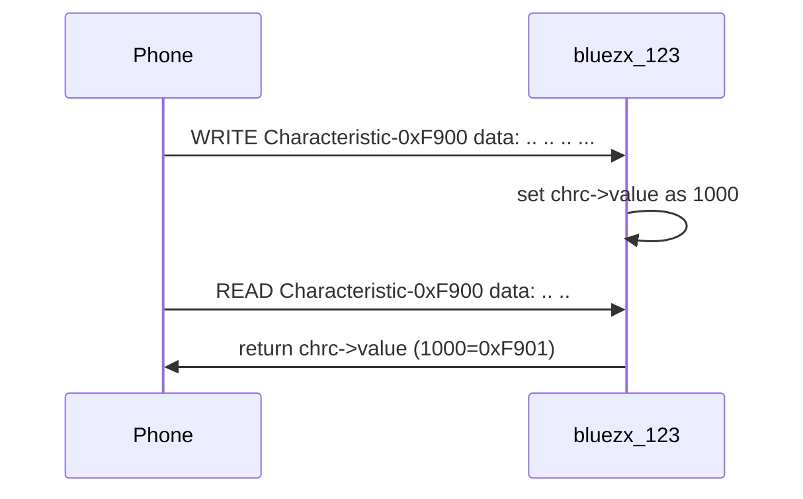

# 1. Overview
BlueZX is based on [BlueZ](http://www.bluez.org/) (bluez-5.56).

It wrapped all features of bluetoothctl and provides some callback functions.

You can create a noninteractive daemon easily.

# 2. Depend on

- [utilx9](https://github.com/lankahsu520/utilx9)
- [BlueZ](http://www.bluez.org)

# 3. Current Status


# 4. Build
   ```
$ make
   ```

# 5. Example or Usage
- bluetoothctl_clone - it is the same as bluetoothctl.

- bluezx_123 - a daemon.

```bash
$ ./bluezx_123 -d3
```

```c
#define UUID16_LANKAHSU520_SERVICE_F999           0xF999
#define UUID16_LANKAHSU520_CHRC_F900              0xF900
#define UUID16_LANKAHSU520_CHRC_F901              0xF901

```

# 6. License
BlueZX is based on [BlueZ](http://www.bluez.org/).


# 7. Documentation
Run an example and read it.


