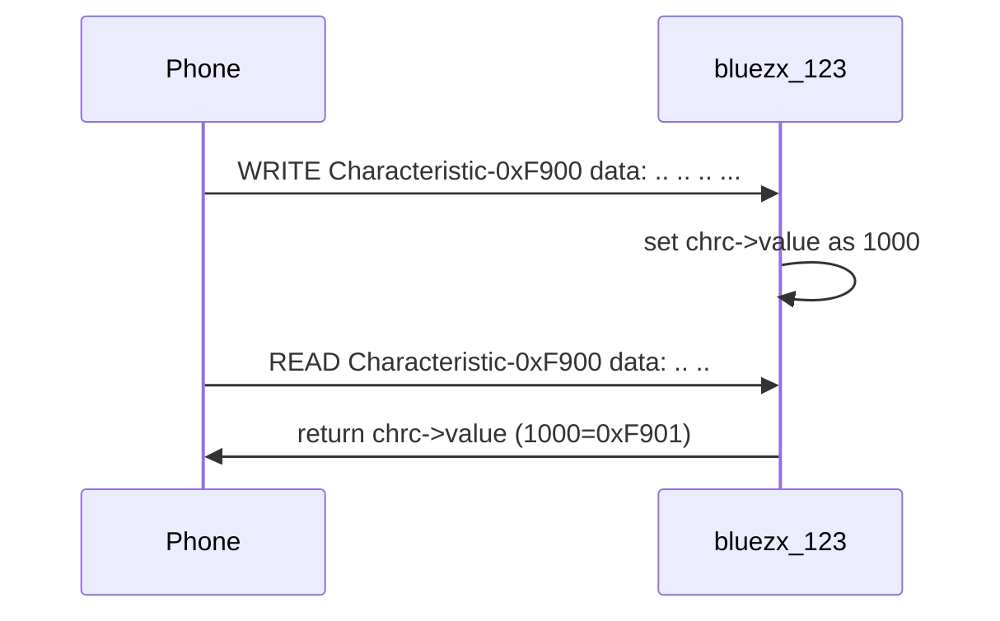

# 1. Overview
BlueZX is based on [BlueZ](http://www.bluez.org/) (bluez-5.56).

It wrapped all features of bluetoothctl and provides some callback functions.

You can create a noninteractive daemon easily.

# 2. Depend on

- [utilx9](https://github.com/lankahsu520/utilx9)
- [BlueZ](http://www.bluez.org)

# 3. Current Status


# 4. Build
   ```
$ make
   ```

# 5. Example or Usage
- bluetoothctl_clone - it is the same as bluetoothctl.

- bluezx_123 - a daemon.

```bash
$ ./bluezx_123 -d3
```

```c
#define UUID16_LANKAHSU520_SERVICE_F999           0xF999
#define UUID16_LANKAHSU520_CHRC_F900              0xF900
#define UUID16_LANKAHSU520_CHRC_F901              0xF901

```

# 6. License
BlueZX is based on [BlueZ](http://www.bluez.org/).


# 7. Documentation
Run an example and read it.

## 7.1. TestCase A



## 7.2. TestCase B


```bash
export BLUEZX_COMMAND="scan&on"
export BLUEZX_COMMAND="scan&off"
export BLUEZX_COMMAND="advertise.name&on"
export BLUEZX_COMMAND="advertise.timeout&120"
export BLUEZX_COMMAND="advertise&on"

export BLUEZX_COMMAND="pair&90:E8:68:85:9A:0A"
export BLUEZX_COMMAND="connect&90:E8:68:85:9A:0A"
export BLUEZX_COMMAND="disconnect&90:E8:68:85:9A:0A"

export BLUEZX_COMMAND="gatt.list-attributes&90:E8:68:85:9A:0A"
export BLUEZX_COMMAND="gatt.select-attribute&0000FFFF-0000-1000-8000-00805f9b34fb"
export BLUEZX_COMMAND="gatt.select-attribute&0000BBBB-0000-1000-8000-00805f9b34fb"
export BLUEZX_COMMAND="gatt.select-attribute&0000AAAA-0000-1000-8000-00805f9b34fb"

export BLUEZX_COMMAND="gatt.write&0xFF 0xFE 0x7B 0x22 0x75 0x73 0x65 0x72 0x22 0x3A 0x22 0x6C 0x61 0x6E 0x6B 0x61 0x22 0x7D 0xFF 0xFF"
export BLUEZX_COMMAND="gatt.write&0xFF 0xFE 0xFF 0xFF"
export BLUEZX_COMMAND="gatt.write&0x1C 0x56"
./dbusx_456 -e "$BLUEZX_COMMAND"
```

